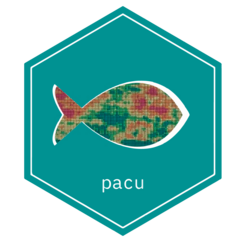

# pacu: Precision Agriculture Computational Utilities 

The *pacu* package allows for processing, visualization, and analysis of yield monitor data. Additionally, this package also allows for retrieval, processing, and visualization of weather and satellite data.

## Installation

pacu is available on CRAN. To install pacu, you can run:

> install.packages("pacu")

To install the development version from github you can try:

> devtools::install_github("cldossantos/pacu")\
> library(pacu)

or you can also try the lightweight 'remotes' package:

> remotes::install_github("cldossantos/pacu")\
> library(pacu)

The vignettes are not automatically built when the package is installed from github. To get started with pacu, you can build the vignettes and check the examples we provide.

> devtools::install_github("cldossantos/pacu", build_vignettes = TRUE)\
> browseVignettes(package = 'pacu')

or you can use the lightweight 'remotes' package:

> remotes::install_github("cldossantos/pacu", build_vignettes = TRUE)\
> browseVignettes(package = 'pacu')

## Package requirements

Imported packages: stars, XML, gstat, units, sf, apsimx, tmap, httr, jsonlite

Suggested packages: spData, knitr, mgcv, concaveman, rmarkdown, ggplot2, patchwork, nasapower, testthat

## Manuscript

You can find the manuscript describing *pacu* [here](https://doi.org/10.1016/j.softx.2024.101971)
